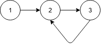
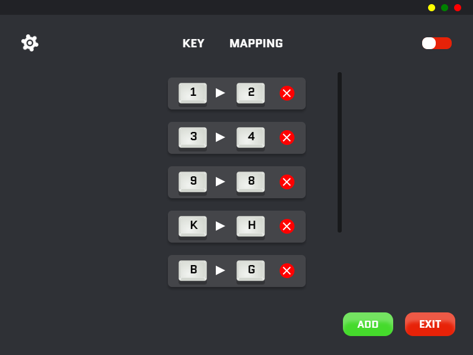
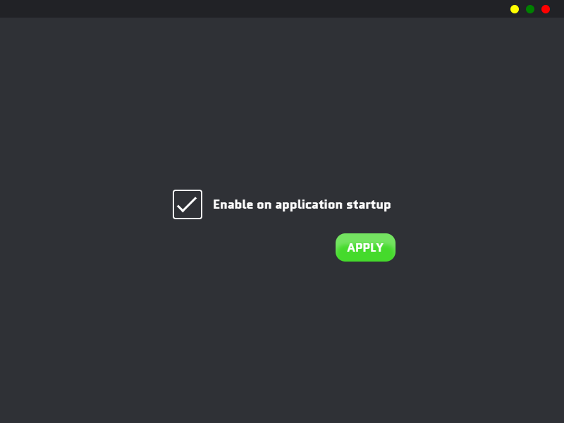
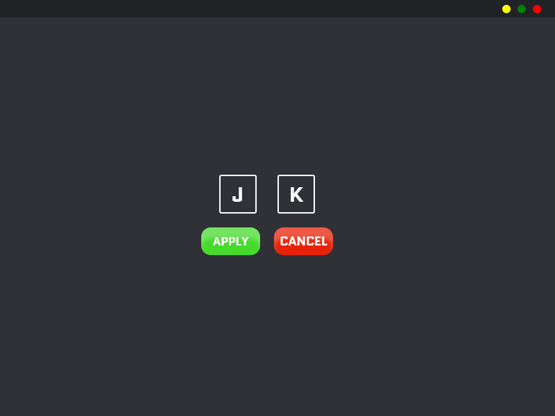

# K-Macros

A simple keyboard macros desktop app made with React and Electron.

## How to run

- navigate to the project's root folder and run `npm start` to run in dev mode.

- To build a production build, run `npm run electron-pack` in the project's root folder.

## How It Works

- The user adds their desired keyboard macros and is stored in a `json` format.

- The app listens to the keyboard events on the main Electron thread using `ioHook`.

- If a registered macro is detected, the corresponding key mapping is retrieved and is programatically pressed.

- `DFS` graph traversal is used to detect any loops in the given macro sequence.

  Ex: assume the following macro sequence `1 -> 2 -> 3 -> 2`   
     
  Clearly, this macro sequence contains a loop and may cause problems. This can be solved by modelling the macro  
  sequence into a <b>directed graph</b> and use `DFS` traversal to check if a node was visited twice.

## Screenshots

 
 

## Future Work

- Use `Robotjs` package instead of the currently used one.

- Remove the 100ms introduced delay.

- Add more settings and suggested options.
